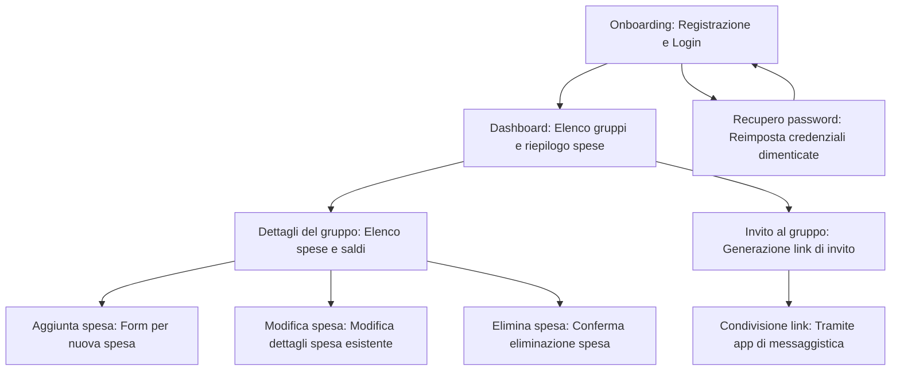

# Roadmap per Quota: Applicazione di Gestione delle Spese Condivise

## **Fase 1: Progettazione**
1. **Definizione delle entità principali**:
   - ~~Progettare il database con le seguenti tabelle:~~ **Completato**
     - **Utenti**: Nome, cognome, email, password (crittografata), provider (Google, Apple, email), avatar (immagine di default).
     - **Gruppi**: Nome del gruppo, membri, link di invito, spese associate.
     - **Spese**: Importo, categoria, data, chi ha pagato, chi partecipa.
     - **Saldi**: Calcolo automatico dei debiti/crediti tra i membri.
     - **Avatar**: Immagini disponibili per gli utenti.
     - **Log_Modifiche**: Registro delle modifiche alle tabelle principali.
2. **Flusso dell'app**:
   - **Definizione del flusso delle schermate principali**:
     - **Onboarding**: Registrazione e login.
     - **Dashboard**: Elenco dei gruppi e riepilogo delle spese.
     - **Dettagli del gruppo**: Elenco delle spese e saldi.
     - **Aggiunta spesa**: Form per inserire una nuova spesa.
     - **Invito al gruppo**: Generazione e condivisione di link di invito.
   - Disegnare un diagramma di flusso per rappresentare la navigazione tra le schermate.
3. **Wireframe**:
   - ~~Creare schizzi dettagliati delle schermate principali per visualizzare il layout e l'interazione utente.~~ **Completato**
4. **Sicurezza e prestazioni**:
   - ~~Pianificare le misure di sicurezza:~~ **Completato**
     - ~~Utilizzare HTTPS per tutte le comunicazioni.~~
     - ~~Crittografare le password con bcrypt.~~
     - ~~Implementare l'autenticazione basata su token JWT.~~
     - ~~Proteggere le API con rate limiting e validazione degli input.~~
   - ~~Definire strategie di prestazioni:~~ **Completato**
     - ~~Ottimizzare le query al database.~~
     - ~~Implementare caching per dati frequentemente richiesti.~~
     - ~~Monitorare le prestazioni con strumenti come New Relic.~~
5. **Localizzazione e accessibilità**:
   - ~~Pianificare il supporto multilingua utilizzando un sistema di traduzione (es. i18n).~~ **Completato**
   - ~~Garantire l'accessibilità:~~ **Completato**
     - ~~Supporto per screen reader.~~
     - ~~Opzioni di contrasto elevato.~~
     - ~~Navigazione tramite tastiera.~~
6. **Scalabilità e backup**:
   - ~~Configurare l'ambiente di sviluppo:~~ **Completato**
     - ~~Utilizzare un server Linux locale con accesso VPN.~~
   - Pianificare backup automatici del database in ambiente di test e produzione (da implementare più avanti).

---

## **Diagramma di flusso delle schermate principali**

---

## **Fase 2: Sviluppo MVP**
1. **Backend**:
   - Configurare il server con una nuova tecnologia (da definire, ad esempio Node.js con Express o Django).
   - Implementare le API per:
     - **Autenticazione**:
       - Registrazione/login con email/password.
       - Integrazione con Google Identity Services e Sign in with Apple.
     - **Gestione gruppi**:
       - Creazione, modifica e cancellazione di gruppi.
       - Generazione e gestione dei link di invito.
     - **Gestione spese**:
       - Aggiunta, modifica e cancellazione di spese.
       - Calcolo automatico dei saldi tra i membri.
     - **Eliminazione account**:
       - Consentire agli utenti di eliminare il proprio account e tutti i dati associati.
   - Configurare backup automatici del database in ambiente di test.
2. **Frontend (React Native)**:
   - Implementare le schermate principali:
     - **Login/registrazione**: Form per l'accesso e la registrazione.
     - **Dashboard**: Visualizzazione dei gruppi e riepilogo delle spese.
     - **Dettagli del gruppo**: Elenco delle spese e saldi.
     - **Aggiunta spesa**: Form per inserire una nuova spesa.
     - **Invio link di invito**: Condivisione tramite app di messaggistica (es. WhatsApp).
     - **Modulo di feedback**: Form per raccogliere opinioni dagli utenti.
   - Configurare Firebase Cloud Messaging per notifiche push su Android e iOS.
3. **Notifiche push**:
   - Implementare notifiche per:
     - Aggiornamenti sulle spese.
     - Promemoria per saldi non regolati.

---

## **Fase 3: Test e feedback**
1. **Test interni**:
   - Verificare il funzionamento delle API e dell'app mobile.
   - Eseguire test di sicurezza:
     - Test di penetrazione per identificare vulnerabilità.
     - Validazione degli input per prevenire attacchi SQL injection e XSS.
   - Monitorare le prestazioni:
     - Ottimizzare i tempi di risposta delle API.
     - Verificare il funzionamento dei backup automatici.
2. **Beta testing**:
   - Rilasciare l'app a un gruppo ristretto di utenti per raccogliere feedback.
   - Monitorare l'utilizzo e raccogliere suggerimenti per miglioramenti.

---

## **Fase 4: Lancio**
1. **Pubblicazione**:
   - Distribuire l'app su Google Play Store e Apple App Store.
2. **Monitoraggio post-lancio**:
   - Monitorare sicurezza e prestazioni in tempo reale.
   - Implementare backup automatici su AWS o Azure.
3. **Aggiornamenti**:
   - Rilasciare aggiornamenti per risolvere eventuali problemi emersi.
   - Integrare nuove funzionalità basate sul feedback degli utenti.
